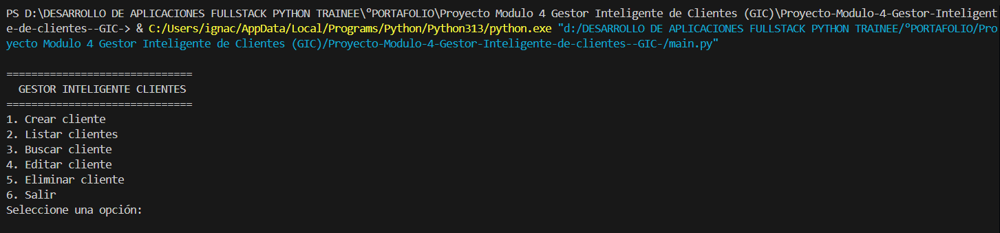
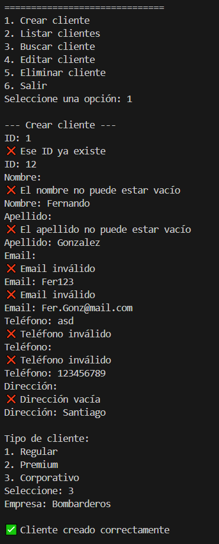
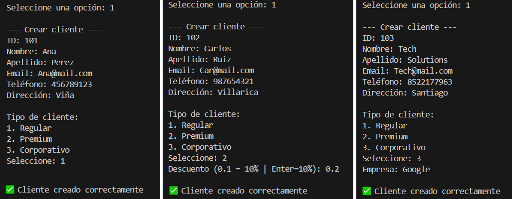
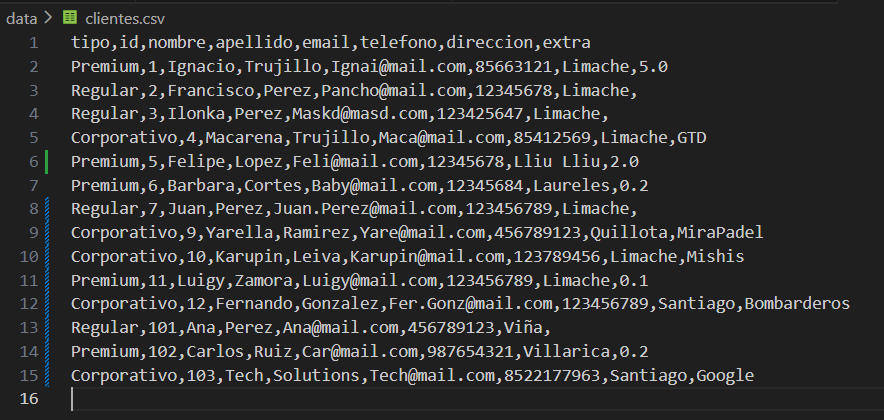
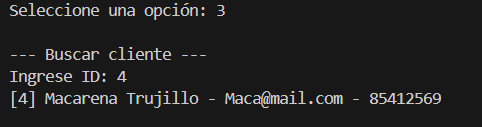
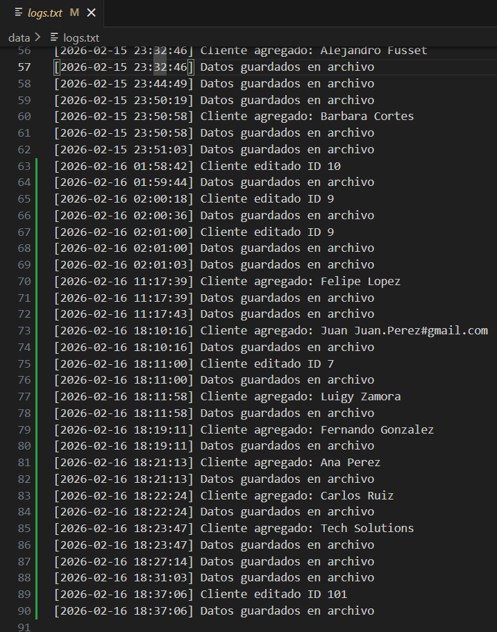
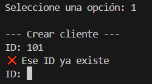

# 📄 Informe de Validación

## Proyecto Módulo 4: Gestor Inteligente de Clientes (GIC) 🐍

## 1. Introducción

El presente informe tiene como objetivo documentar el proceso de validación del **Gestor Inteligente de Clientes (GIC)**, desarrollado para la empresa SolutionTech como parte del proyecto final del módulo 4.

El sistema implementa el paradigma de **Programación Orientada a Objetos (POO)**, utilizando clases, herencia y polimorfismo. Además, incorpora persistencia de datos en archivos (CSV/TXT), validaciones avanzadas mediante expresiones regulares (Regex) y un sistema de registro de logs para auditoría.

---

## 2. Entorno de pruebas

Las pruebas del sistema fueron realizadas en el siguiente entorno:

* **Sistema operativo:** Windows 11 
* **Lenguaje:** Python 3.x
* **Editor de código:** Visual Studio Code
* **Ejecución:** Consola (Terminal)
* **Persistencia:** Archivos locales (.csv y .txt)
* **Dependencias:** Librerías estándar (`csv`, `os`, `re`, `datetime`)

---

## 3. Casos de prueba realizados

### 3.1 Inicio del sistema y carga de datos

**Descripción:**
Se ejecuta el archivo `main.py` para verificar el despliegue del menú y la carga automática de clientes existentes desde el archivo `data/clientes.csv`.

**Entrada:**

* Ejecución del comando `python main.py`

**Resultado esperado:**

* El sistema crea la carpeta `data` si no existe.
* Se muestra el menú principal con las 6 opciones disponibles.

**Resultado obtenido:**

* El menú se despliega correctamente y el sistema queda a la espera de instrucciones.

---

### 3.2 Creación de Cliente con Validaciones (Regex)

**Descripción:**
Se intenta crear un cliente ingresando campos vacios, un formatos de email y telefono inválidos para verificar la robustez del módulo `validaciones.py`.

**Entrada:**

* Nombre: Fernando
* Apellido: Gonzalez
* Email: `Fer.Gonz@mail.com`
* Telefono: 123456789
* Dirección: Santiago

**Resultado esperado:**

* El sistema debe lanzar un error y solicitar el dato nuevamente o mostrar el mensaje de "Email inválido".

**Resultado obtenido:**

* El sistema detecta el formato incorrecto mediante `re.match` y rechaza la entrada, protegiendo la integridad de los datos.

`

---

### 3.3 Creación de Diferentes Tipos de Clientes (Polimorfismo)

**Descripción:**
Se registran clientes utilizando las subclases `ClienteRegular`, `ClientePremium` y `ClienteCorporativo` para verificar la herencia y los atributos únicos.

**Entrada:**

1. **Regular:** ID 101 | Ana Perez
2. **Premium:** ID 102 | Carlos Ruiz | Descuento: 0.2
3. **Corporativo:** ID 103 | Tech Solutions | Empresa: Google

**Resultado esperado:**

* El sistema solicita los datos extra (`descuento` o `empresa`) según la opción seleccionada.
* Se confirma el registro exitoso.

**Resultado obtenido:**

* Los tres tipos de clientes se crean correctamente respetando sus atributos específicos.

---

### 3.4 Listado y Persistencia en CSV

**Descripción:**
Se utiliza la opción "Listar clientes" para verificar que los datos se muestran en memoria y, posteriormente, se revisa el archivo físico `data/clientes.csv` para confirmar la persistencia.

**Entrada:**

* Opción 2 del menú.

**Resultado esperado:**

* Consola: Muestra la lista de clientes ordenados por ID.
* Archivo CSV: Contiene una nueva fila con los datos guardados, incluyendo el campo "extra" (descuento o empresa).

**Resultado obtenido:**

* La información coincide perfectamente entre la memoria del programa y el archivo CSV.

<table>
<tr>
<th style="text-align: center;">Vista en Consola</th>
<th style="text-align: center;">Archivo CSV Generado</th>
</tr>
<tr>
<td></td>
<td></td>
</tr>
</table>

---

### 3.5 Buscar clientes

**Descripción:**
Se escoje la opción 3 y se busca un cliente mediante el ID.

**Entrada:**

* ID Cliente: 4

**Resultado esperado:**

* El sistema debera mostrar el cliente que tiene asignado el ID buscado.

**Resultado obtenido:**

* Los datos se muestran en consola

---

### 3.6 Edición de Cliente

**Descripción:**
Se modifica el teléfono y el correo de un cliente existente.

**Entrada:**

* ID Cliente: 101
* Nuevo Email: `ana.nueva@gmail.com`
* Enter en los demás campos para mantener el valor original.

**Resultado esperado:**

* El sistema actualiza solo los campos modificados y mantiene los anteriores.
* Se genera una entrada en `logs.txt` registrando la edición.

**Resultado obtenido:**

* Los datos se actualizaron correctamente y el cambio se reflejó inmediatamente en el archivo CSV.

---

### 3.7 Auditoría (Logs)

**Descripción:**
Se verifica que las acciones críticas (Agregar, Eliminar, Editar) hayan quedado registradas en el sistema de logs.

**Entrada:**

* Apertura del archivo `data/logs.txt`.

**Resultado esperado:**

* El archivo debe contener líneas con fecha, hora y descripción de la acción.

**Resultado obtenido:**

* El archivo de logs registra correctamente la trazabilidad de las operaciones.

---

### 3.8 Manejo de Errores (ID Duplicado)

**Descripción:**
Se intenta crear un nuevo cliente con un ID que ya existe en la base de datos.

**Entrada:**

* ID: 101 (Ya existente)

**Resultado esperado:**

* El sistema impide la creación y avisa que el ID ya está ocupado.

**Resultado obtenido:**

* El sistema muestra "❌ Ese ID ya existe" y solicita uno nuevo.

---

## 4. Análisis de resultados

Las pruebas realizadas validan la correcta implementación de los pilares de la Programación Orientada a Objetos:

1. **Encapsulamiento:** Los datos sensibles fueron protegidos y solo modificados a través de los *setters* con validación.
2. **Herencia:** Se logró diferenciar correctamente entre clientes Regulares, Premium y Corporativos.
3. **Persistencia:** El sistema mantiene la información entre ejecuciones gracias al manejo de archivos CSV.
4. **Robustez:** Las validaciones de `Regex` y el manejo de excepciones (`try-except`) evitaron caídas del sistema ante datos incorrectos.

---

## 5. Conclusión

El sistema **Gestor Inteligente de Clientes** cumple con los objetivos planteados en la evaluación del módulo 4, implementando correctamente los principios de la Programación Orientada a Objetos (POO), persistencia de datos, validaciones y registro de actividad.

La arquitectura modular facilita la escalabilidad y el mantenimiento del código, permitiendo futuras integraciones con bases de datos reales o interfaces gráficas.

El proyecto representa una solución funcional y extensible, alineada con buenas prácticas de desarrollo en Python.
